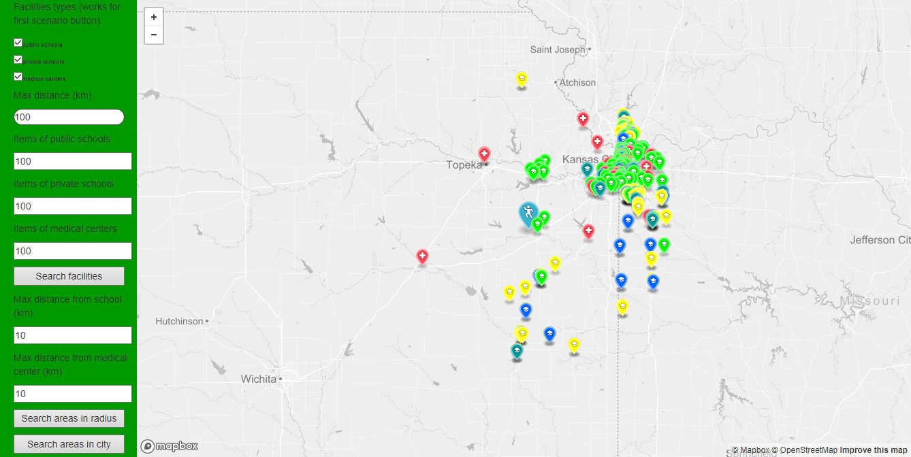
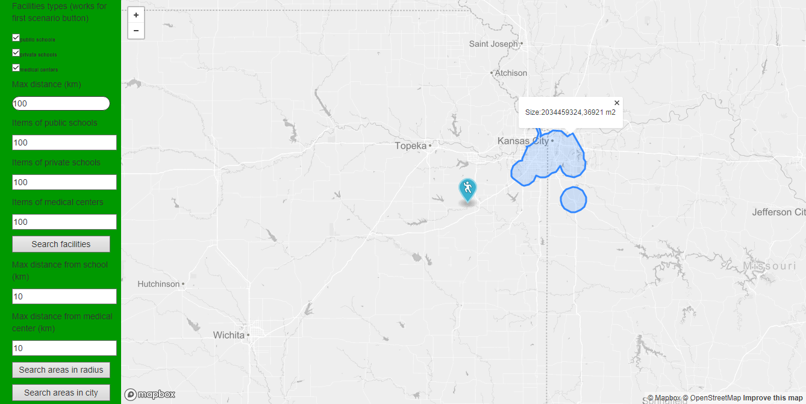
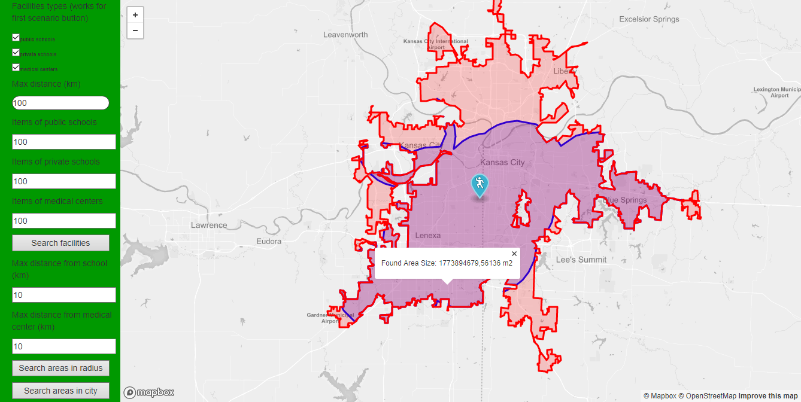
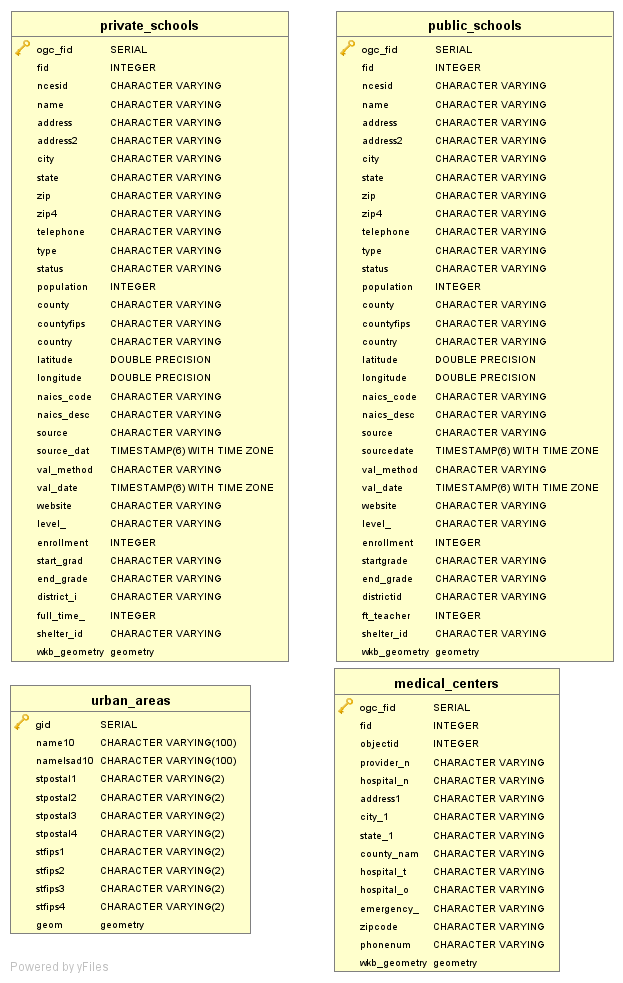

# Overview

This application shows schools and medical centers in USA on a map. Most important features are:
- search facilities in radius from my current location with distance option and facility type options
- search areas in radius from my current location with distance option, which are selected distance from schools and selected distance from medical centers
- search areas in urban area in current location, which are selected distance from schools and selected distance from medical centers
- schools have same marker icon with changing color by level (elementary, high etc.) and medical centers have another marker icon
- urban areas and found areas have different colors to see both, because found area is part of urban area

This is it in action:

Screenshot of facilities search

Screenshot of intersections area

Screenshot of intersections area in urban area

The application has 2 separate parts, the client which is a [frontend web application](#frontend) using mapbox API and mapbox.js and the [backend application](#backend) written in [C#](https://docs.microsoft.com/en-us/dotnet/csharp/) and [ASP.net](https://www.asp.net), backed by PostGIS. The frontend application communicates with backend using a [REST API](#api).

# Frontend

The frontend application is a dynamic aspx page (`Map.aspx`), which shows a mapbox.js widget. It is displaying facilities, concretely schools and medical centers, which are mostly in cities. Style I used is Mapbox-Light style without changes, because gray map suited better than others, which have many disturbing effects.

Frontend is simple, there is one form with 2 nested div elements: menu and map:
- map has movable position mark which is marking selecterd center area
- menu is the sidebar panel with filtering controls, handling the user interaction and calling the appropriate backend APIs
- map is displaying geo features by overlaying the map with a geojson layer, the geojson is prepared and is provided by backend APIs

# Backend

The backend application is written in C# with ASP.NET and is responsible for querying geo data from postgis database, formatting the geojson and inserting marker style to geojson.

## Data

[Private](https://hub.arcgis.com/datasets/DHS-GII::private-schools) and [public](https://hub.arcgis.com/datasets/DHS-GII::public-schools) schools data and [medical centers](https://hub.arcgis.com/datasets/7427f63124164c5aaaad4e5aa62bd3ee_0) data are coming from [Arcgis hub](https://hub.arcgis.com) and [urban areas](https://earthworks.stanford.edu/catalog/stanford-vt734jy6725) data are coming from [Standford Earthworks](https://earthworks.stanford.edu)
Data from Arcgishub were imported using the `ogr2ogr` tool which imports data from geojson to postgis database and data from Earthworks with `shp2pgsql` tool which imports shapefile data to postgis database. To speedup the queries I created an indexes on geometry columns in all tables. GeoJSON from postgis database is generated by using a standard `st_asgeojson` function.

## Api

**Find selected facilities in radius from marker**

HTTP POST method via Ajax with url: `'Map.aspx/ShowCheckedPoints'`

**Find areas of intersection in radius from marker which shows areas in selected distance from schools and medical centers**

HTTP POST method via Ajax with url: `'Map.aspx/ShowAreas'`

**Find areas of intersection which shows areas in selected distance from schools and medical centers which are in urban areas of city where the marker is**

HTTP POST method via Ajax with url: `'Map.aspx/ShowAreasInCity'`

### Response

API calls return json responses with formated `geojson`. This `geojson` contains points or areas and style definitions.
